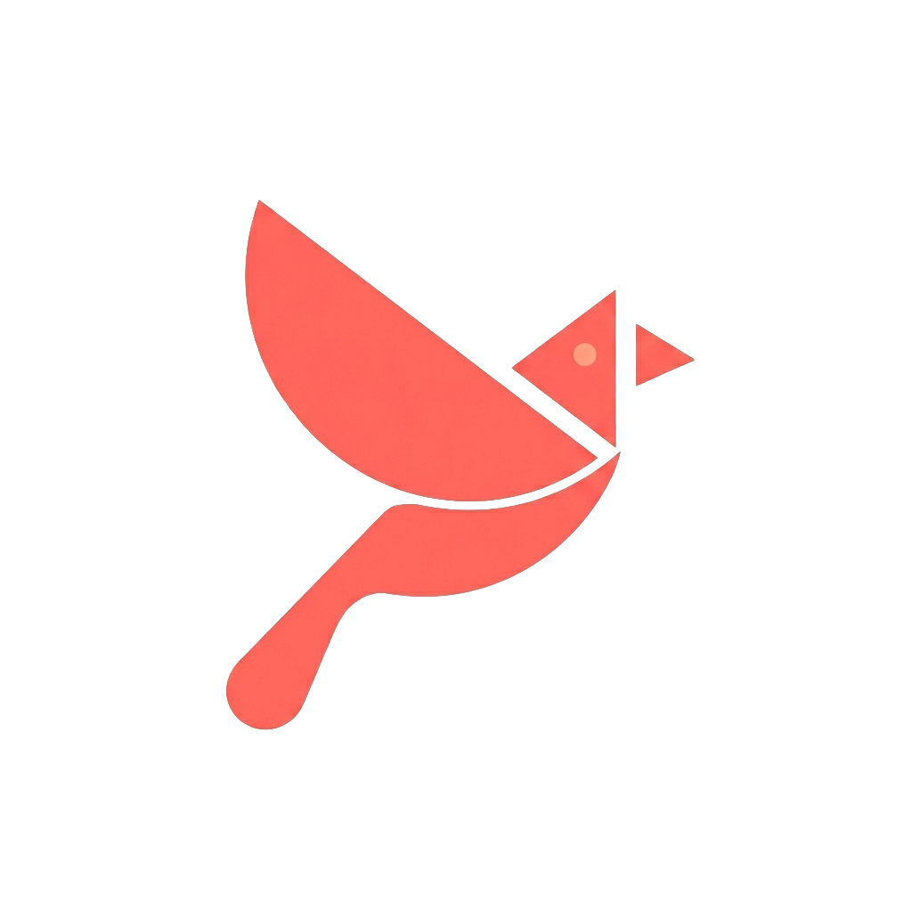
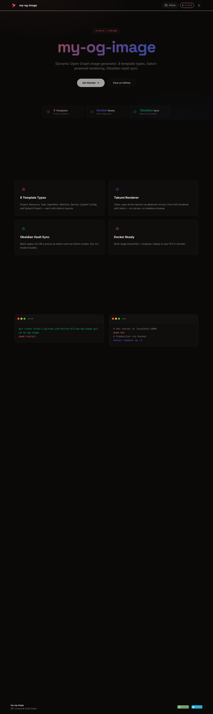

<div align="center">

[](https://github.com/Sofian-bll/my-og-image/blob/main/LICENSE)
[](https://github.com/Sofian-bll/my-og-image/releases)
[](https://github.com/Sofian-bll/my-og-image/stargazers)

<p align="center">
  
</p>

<a id="readme-top"></a>
<h1 align="center">my-og-image</h1>

<p align="center">Generateur d'images Open Graph dynamiques, propulse par Nuxt et le renderer Takumi.</p>

<p align="center">🇬🇧 <a href="README.md">English</a> · 🇫🇷 <a href="README.fr.md"><b>Français</b></a></p>

</div>

---

<p align="center">
  <a href="https://sofian-bll.github.io/my-og-image/"><strong>Explorer la doc</strong></a>
  ·
  <a href="https://github.com/Sofian-bll/my-og-image/issues/new?labels=bug">Signaler un bug</a>
  ·
  <a href="https://github.com/Sofian-bll/my-og-image/issues/new?labels=enhancement">Suggerer une fonctionnalite</a>
</p>

<details open>
<summary>Table des matieres</summary>

- [C'est quoi ?](#cest-quoi-)
- [Fonctionnalites](#fonctionnalites)
- [Comment ca marche](#comment-ca-marche)
- [Demo](#demo)
- [Stack technique](#stack-technique)
- [Prerequis](#prerequis)
- [Demarrage rapide](#demarrage-rapide)
- [Configuration](#configuration)
- [Utilisation](#utilisation)
- [Structure du projet](#structure-du-projet)
- [Contribuer](#contribuer)
- [Licence](#licence)
- [Star History](#star-history)

</details>

## C'est quoi ?

my-og-image genere des images Open Graph 1200×630 a partir du frontmatter Markdown — transformant des notes Obsidian en cartes sociales pour Twitter, Discord et les apercus de liens. Construit avec [Nuxt 4](https://nuxt.com/), le [renderer Takumi](https://github.com/hywax/takumi) et [nuxt-og-image](https://github.com/nuxt-modules/og-image), il sert huit templates dedies via un seul endpoint API.

<p align="right">(<a href="#readme-top">haut de page</a>)</p>

## Fonctionnalites

- **8 types de templates** — Aspiration, Epitech Project, Machine, Project, Resource, Service, System Config, Task — chacun avec son propre layout, degrade et jeu d'icones
- **Renderer Takumi** — layouts bases sur Satori via `@takumi-rs/core`
- **Systeme d'eyebrow** — decoupage automatique des titres sur les separateurs (` - `, ` — `, ` | `), affichant le contexte sous forme de badge
- **Context pills** — icones Lucide associees aux metadonnees de lieu/contexte (ordinateur, ecole, maison, etc.)
- **Sync vault Obsidian** — script Python pour appliquer les URLs OG en masse sur toutes les notes d'un vault
- **Pret pour Docker** — build multi-etapes et fichiers compose pour le dev local et la production
- **Police personnalisee** — Syne via Google Fonts, optimisee pour les titres a plusieurs tailles

<p align="right">(<a href="#readme-top">haut de page</a>)</p>

## Comment ca marche

```mermaid
graph LR
    A[Note Markdown] --> B[/api/og/:template]
    B --> C[Composant Template]
    C --> D[Renderer Takumi]
    D --> E[nuxt-og-image]
    E --> F[PNG 1200x630]
    F --> G[Carte Sociale]
```

Le frontmatter d'une note (titre, sous-titre, tags, statut, dates) est passe en parametres de requete a `/api/og/:template`. Le composant Vue correspondant assemble un layout Takumi, le renderer produit un PNG, et `nuxt-og-image` gere le cache et les en-tetes HTTP. Chaque template a son propre degrade, sa palette d'icones et son echelle typographique — le tout pilote par la config de type dans `src/templates/`.

<p align="right">(<a href="#readme-top">haut de page</a>)</p>

## Demo

<p align="center">
  
</p>

Voir la landing page : [sofian-bll.github.io/my-og-image](https://sofian-bll.github.io/my-og-image/)

<p align="right">(<a href="#readme-top">haut de page</a>)</p>

## Stack technique

- [](https://nuxt.com/) — Framework
- [](https://vuejs.org/) — UI framework
- [](https://www.typescriptlang.org/) — Langage
- [](https://nodejs.org/) — Runtime
- [](https://www.docker.com/) — Conteneurisation

<p align="right">(<a href="#readme-top">haut de page</a>)</p>

## Prerequis

- [Node.js](https://nodejs.org/) ≥ 18
- [pnpm](https://pnpm.io/) (lockfile : `pnpm-lock.yaml`)
- [Docker](https://www.docker.com/) (optionnel, pour le deploiement conteneurise)

<p align="right">(<a href="#readme-top">haut de page</a>)</p>

## Demarrage rapide

```bash
# Installer les dependances
pnpm install

# Serveur de developpement (http://localhost:3000)
pnpm dev
```

### Docker

```bash
# Production
docker compose up -d

# Developpement (hot reload)
docker compose -f docker-compose.dev.yml up -d
```

<p align="right">(<a href="#readme-top">haut de page</a>)</p>

## Configuration

Tous les reglages sont dans `nuxt.config.ts` :

```ts
export default defineNuxtConfig({
  modules: ['nuxt-og-image', '@nuxt/fonts'],

  site: {
    url: 'https://og.sofian.lab',   // URL de deploiement
  },

  fonts: {
    families: [
      { name: 'Syne', weights: [400, 700], provider: 'google' },
    ],
  },

  ogImage: {
    renderer: 'takumi',
    defaults: {
      width: 1200,
      height: 630,
    },
  },
})
```

Les couleurs des templates et les regles d'eyebrow sont configurees dans `src/templates/colors.ts` et `src/templates/eyebrow-config.ts`.

<p align="right">(<a href="#readme-top">haut de page</a>)</p>

## Utilisation

Les images OG sont servies a :

```
/api/og/:template?title=...&subtitle=...&tags=...&status=...
```

### Templates et parametres

| Template | Parametres cles |
|----------|----------------|
| Aspiration | `title`, `subtitle`, `status`, `statusLabel`, `tags` |
| EpitechProject | `title`, `subtitle`, `status`, `tags`, `priority` |
| Machine | `title`, `subtitle`, `url`, `cover`, `status` |
| Project | `title`, `subtitle`, `status`, `url`, `tags` |
| Resource | `title`, `subtitle`, `status`, `type`, `tags` |
| Service | `title`, `subtitle`, `url`, `cover`, `status`, `tags` |
| SystemConfig | `title`, `subtitle`, `host`, `url` |
| Task | `title`, `subtitle`, `context`, `status`, `start`, `end`, `priority` |

### Exemples rapides

```
/api/og/Resource?title=Design Systems - The Complete Guide&status=in_progress&type=Article&tags=design,systems,css
/api/og/Task?title=Set up CI/CD pipeline&context=school&status=todo&start=2026-03-01&priority=high
/api/og/Aspiration?title=Build a design system from scratch&status=paused&statusLabel=PAUSED
```

### Automatisation Obsidian

Le script `scripts/apply-og-images-homelab.py` scanne un vault Obsidian et ecrit les URLs OG dans le frontmatter de chaque note :

```bash
python scripts/apply-og-images-homelab.py /chemin/vers/vault/obsidian --base-url https://votre-domaine.com
```

<p align="right">(<a href="#readme-top">haut de page</a>)</p>

## Structure du projet

```
assets/               Logo (PNG)
components/OgImage/   Composants template (*.takumi.vue)
docs/                 Landing page + assets
scripts/              Utilitaires sync vault
server/api/og/        Endpoint API ([template].get.ts)
src/templates/        Config theme (couleurs, regles eyebrow, icones)
app.vue               Composant racine
docker-compose.yml    Compose production
Dockerfile            Build multi-etapes
nuxt.config.ts        Configuration Nuxt
```

<p align="right">(<a href="#readme-top">haut de page</a>)</p>

## Contribuer

Les contributions sont les bienvenues. Ouvrez une issue pour discuter de ce que vous souhaitez modifier.

1. Forkez le repo
2. Creez une branche (`git checkout -b feature/amazing`)
3. Committez vos changements (`git commit -m 'feat: add amazing thing'`)
4. Poussez la branche (`git push origin feature/amazing`)
5. Ouvrez une Pull Request

<p align="center">
  
</p>

<p align="right">(<a href="#readme-top">haut de page</a>)</p>

## Licence

MIT © 2026 Sofian — voir [LICENSE](LICENSE) pour plus de details.

<p align="right">(<a href="#readme-top">haut de page</a>)</p>

## Star History

<p align="center">
  <a href="https://star-history.com/#Sofian-bll/my-og-image&Date">
    
  </a>
</p>

---

<!-- REFERENCE_LINKS -->
[Nuxt]: https://nuxt.com/
[nuxt-og-image]: https://github.com/nuxt-modules/og-image
[Takumi renderer]: https://github.com/hywax/takumi
[@takumi-rs/core]: https://github.com/hywax/takumi
[Node.js]: https://nodejs.org/
[Docker]: https://www.docker.com/
[pnpm]: https://pnpm.io/
[Vue.js]: https://vuejs.org/
[TypeScript]: https://www.typescriptlang.org/
[Google Fonts]: https://fonts.google.com/
